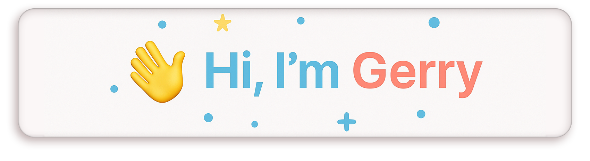
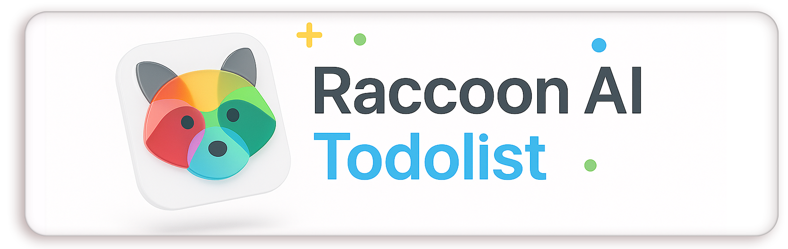

  

Actively seeking <strong>Summer 2026 Software Engineering Internship</strong> opportunities

### 🧩 When I code, I use:

  
  
  
  
  
  
  
  
  
  
  
  
  
  
  
  
  

## 🧭 About Me

Hi, I'm Gerry — a **Computer Science graduate student at Northeastern University**.  
I enjoy building **AI-driven and full-stack applications** that make systems smarter and more intuitive.  

Before transitioning into CS, I worked in architecture and design, which taught me to think structurally and creatively.

- 🎯 Focus: **Full-Stack Development • Backend • AI**  
- 🔍 Exploring: RAG frameworks, generative agents, computational logic  
- 💡 Projects: AI-assisted Todo app, design automation tools, VR puzzle game  
- 🎓 Looking for **Summer 2026 software / AI internships**  

## Featured Project

  

### Raccoon AI Todolist
An AI-driven full-stack productivity web app that combines intelligent task generation with a clean and responsive design. Built with LangChain to help users plan with AI, organize, and manage learning goals more efficiently.  

**Keywords:** AI • Full Stack • Multiservice • MERN • JWT

## 🧠 Research & Vision

I’m dedicated to exploring how **computer science can transform architecture** — using algorithms, AI, and data-driven systems to rethink spatial design and creativity.  
As an **independent researcher**, I focus on computational design, generative systems, and human–machine collaboration in the creative process.  

📄 Read my paper: [My Research Paper](https://doi.org/10.1016/j.jobe.2024.111621)

## 🎨 Fun Facts About Me

- 🕹️ I once built a **VR puzzle game**, blending architecture and computer science.  
- 🎿 I love **skiing, snowboarding, hiking**, and exploring new trails.  
- 🗣️ I enjoy **talking with people** and learning from different perspectives.  
- 🖼️ I'm drawn to **art, design**, specially 3D and Computational Generated Art  
- 🎨 I’m also an **artist** — check out my works at [Portfolio](https://gerrytao.com/)

---

### 🤝 Connect with Me

  
  

  Thanks for visiting my profile! 👋  
  Always open to learning, collaboration, and new opportunities.

